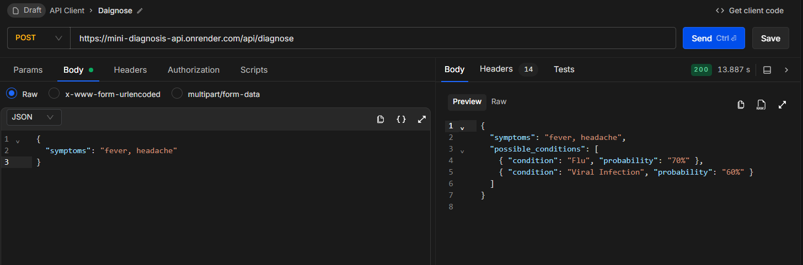
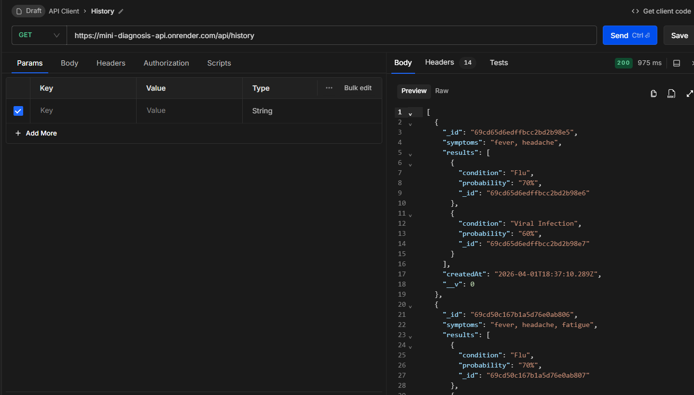

# Mini Diagnosis API

```md
🚀 Live Demo: https://mini-diagnosis-api.onrender.com

```

A simple backend system that analyzes user symptoms and returns possible medical conditions with probability scores. It also stores all diagnosis history using MongoDB.

---

##  Features

-  Analyze symptoms using rule-based logic  
-  Return 2–3 possible conditions with probability percentages  
-  Store every diagnosis request in MongoDB  
-  Fetch complete diagnosis history  
-  Fast and lightweight REST API  

---

##  Tech Stack

- **Backend:** Node.js, Express.js  
- **Database:** MongoDB Atlas  
- **ODM:** Mongoose  

---

##  API Endpoints

### 🔹 Diagnose Symptoms
**POST** `/api/diagnose`

**Request Body:**
```json
{
  "symptoms": "fever, headache, fatigue"
}
```

```json
{
  "symptoms": "fever, headache, fatigue",
  "possible_conditions": [
    { "condition": "Flu", "probability": "70%" },
    { "condition": "Viral Infection", "probability": "60%" }
  ]
}
```

**GET** `/api/history`

```json
[
  {
    "_id": "69cd4f7067b1a5d76e0ab7fd",
    "symptoms": "fever, headache, fatigue",
    "results": [
      {
        "condition": "Flu",
        "probability": "70%",
        "_id": "69cd4f7067b1a5d76e0ab7fe"
      },
      {
        "condition": "Viral Infection",
        "probability": "60%",
        "_id": "69cd4f7067b1a5d76e0ab7ff"
      },
      {
        "condition": "Anemia",
        "probability": "50%",
        "_id": "69cd4f7067b1a5d76e0ab800"
      }
    ],
    "createdAt": "2026-04-01T17:01:36.829Z",
    "__v": 0
  }
]
```

##  API Preview

### 🔹 Diagnose API


### 🔹 History API



##  Live API

The API is deployed and accessible at:

 https://mini-diagnosis-api.onrender.com

---

##  Test the API

### 🔹 Diagnose Endpoint
**POST**  
https://mini-diagnosis-api.onrender.com/api/diagnose  

**Body:**
```json
{
  "symptoms": "fever, headache, fatigue"
}
```

### 🔹 Get Diagnosis History

**GET**  
https://mini-diagnosis-api.onrender.com/api/history  

**Description:**  
Fetch all previously stored diagnosis records from the database.

---

**Response:**
```json
[
  {
    "_id": "6612a1b2c3d4e5f678901234",
    "symptoms": "fever, headache, fatigue",
    "results": [
      { "condition": "Flu", "probability": "70%" },
      { "condition": "Viral Infection", "probability": "60%" },
      { "condition": "Anemia", "probability": "50%" }
    ],
    "createdAt": "2026-04-01T10:30:00.000Z"
  }
]
```